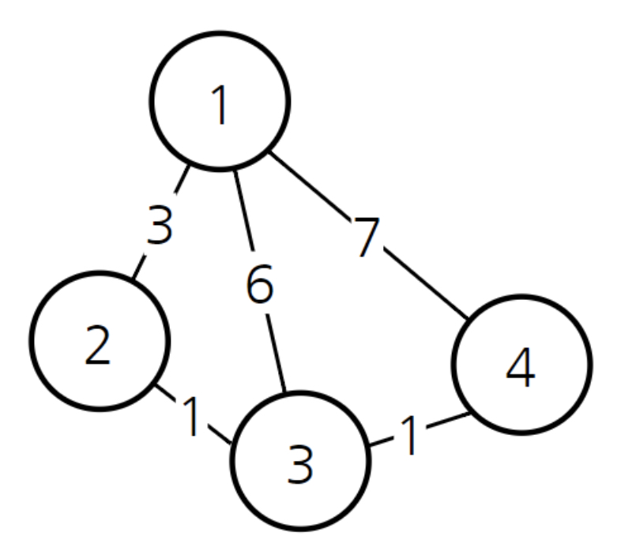
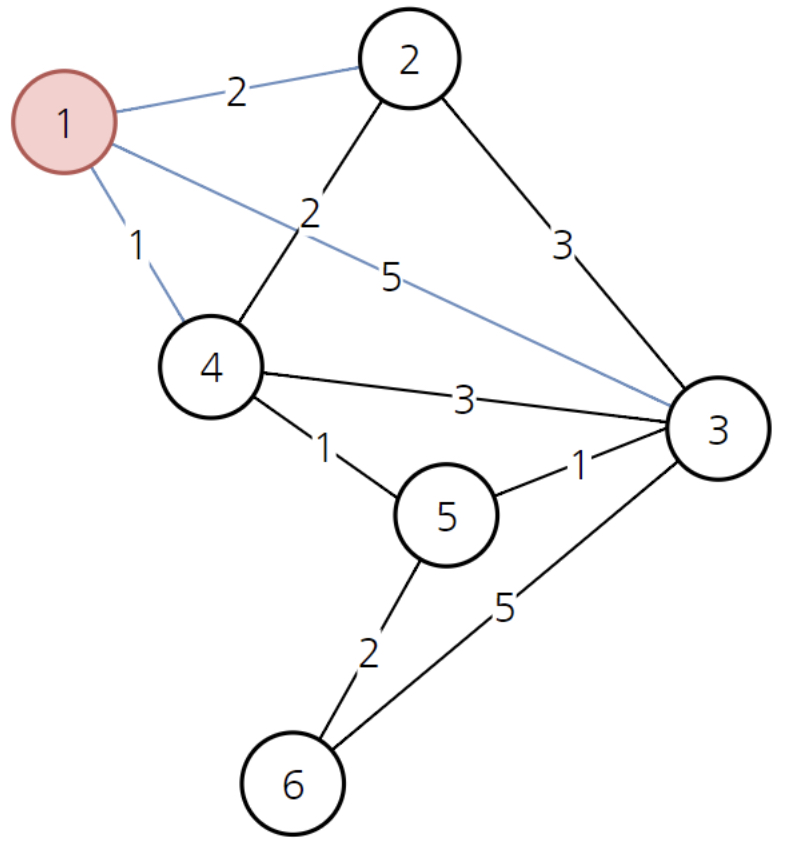

# Path Planning

### 01. Path Planning
Path Planning : 목표 지점까지 이동하는 경로를 계획하는 과정. 최적의 경로를 계획하여 목표 지점까지 안전하고 빠르게 이동할 수 있도록 경로를 계획한다.

- Global Planning : 전체 Global Map 안의 출발 지점에서 도착 지점까지 갈 수 있는 수 많은 경로 중 하나의 경로를 선택하는 기술  EX) A* 알고리즘, Dijkstra 알고리즘 
- Local Path Planning : Local Map 안에서 주변 정보를 실시간으로 처리하는 기술

### Dijkstra Algorithm
다이나믹 프로그래밍(하나의 큰 문제를 여러 개의 작은 문제로 나누어 푸는 방법론)을 활용한 대표적인 **최단 경로 탐색 알고리즘**이다. 이 알고리즘은 하나의 정점에서 다른 모든 정점으로 가는 최단 경로를 알려준다. 이때 **음의 간선**을 포함하면 안되는데, 현실에서는 음의 간선이 존재하지 않기 때문에 **현실 세계에서 사용하기 적합한 알고리즘** 이라고 할 수 있다. 한편 다익스트라 알고리즘이 다이나믹 프로그래밍 문제인 이유는, **최단 거리는 여러 개의 최단 거리로 이루어져 있기 때문이다.** 다익스트라 알고리즘은 하나의 최단 거리를 구할 때 그 이전까지 구했던 최단 거리 정보를 그대로 사용한다는 특징을 가진다. 또한 **현재까지 알고 있던 최단 경로를 계속해서 갱신**한다는 특징을 가진다.

1에서 다른 모든 노드로 가는 최단 경로를 구한다고 하자. 우선 1->3인 6을 구하고, 1->2인 3을 구했다고 한다면, 1->3보다는 1->2->3인 4가 더 최소 거리임을 알 수 있다. 그렇게 3으로 가는 최소 비용 6을 새롭게 경로 1->2->3인 4로 갱신하게 되는 것이다. 

### 알고리즘 동작 과정
1. 출발 노드 설정
2. 출발 노드를 기준으로 각 노드의 최소 비용 저장
3. 방문하지 않은 노드 중에서 가장 비용이 적은 노드를 선택
4. 해당 노드를 거쳐서 특정한 노드로 가는 경우를 고려해 최소 비용을 갱신
5. 3~4번 과정의 반복
  
   

 
1. 우선 1번 노드를 선택했다면, 1번 노드에서 1~6의 다른 정점으로 가는 최소 비용은 다음과 같다.
  

|1->1|1->2|1->3|1->4|1->5|1->6| 
|:---:|:---:|:---:|:---:|:---:|:---:|
|0|2|5|1|INF|INF| 

 
2. 아직 방문하지 않은 노드 중에서 가장 비용이 적은 노드는 4번이므로, 4번 노드를 선택한다. 4번 노드를 거쳐서 특정한 노드로 가는 경우를 고려하여 최소 비용을 갱신한다. 
3. 

### A* Algorithm
주어진 출발 노드에서 목표 노드까지 가는 최단 경로를 찾아내는 그래프 탐색 알고리즘 중 하나이다. **Dijkstra 알고리즘**과 유사하나, 목표 노드 까지의 **휴리스틱 거리** (A 노드에서 B 노드까지 가는 예상 거리) 측정 값도 사용한다는 차이점이 있다.